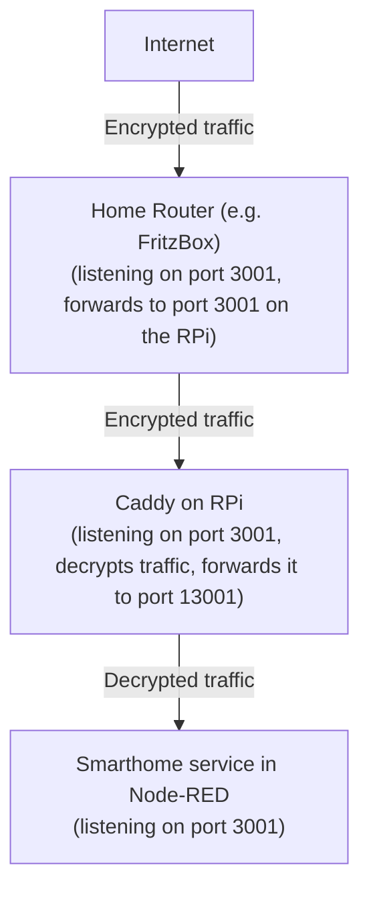

# Caddy as reverse proxy

This is an example on how you run the smarthome service behind Caddy (see [caddyserver.com](https://caddyserver.com/))
as a reverse proxy.

## Benefits:
- SSL certificates are automatically managed and renewed by Caddy.
- You don't need to install and configure Certbot.
- You don't need to restart Node-RED on certificate renewals configure certificate paths in Node-RED and 

## Guide
1. On your home router forward port 3001 to the host where Node-RED is running.
2. In Node-RED open the Google Smarthome management Node and set the port to 13001 (to free up port 3001 for Caddy).
   Also enable the checkbox "Use external SSL offload". Then save and deploy. DON'T forward port 13001 on your home
   router.
3. Check if the new port is reachable by opening https://192.168.0.100:13001/ in your browser (assuming 192.168.0.100 is
   the host where Node-RED and Caddy are running). You should see the Google Smarthome test page.
4. Install Caddy (on Ubuntu it's `apt-get install caddy`).
5. Edit Caddy's config file (on Ubuntu it is located in `/etc/caddy/Caddyfile`)
6. Remove all existing content and add the following lines:

```
{
    # Email used by Let's Encrypt to contact you  
    email info@example.com
}

# Let Caddy use the domain 'example.com' and listen with HTTPS encryption on port 3001
https://example.com:3001 {
    # Proxy requests to Node-RED on localhost, port 13001
    reverse_proxy localhost:13001
}
```

6. Restart Caddy (on Ubuntu it's `systemctl restart caddy`)
7. Wait a minute. Certificate creation may take a while.
8. Open https://example.com:3001/check in your browser. You should see the Google Smarthome test page.
9. Done!


For a better understanding, the flow of traffic in this setup is as follows:




## Node-RED behind Caddy (optional)
You can also use Caddy to deliver Node-RED.

This guide assumes Node-RED uses port 1880 (`uiPort` in `settings.js`) and is running on host 192.168.0.100. Node-RED
will be made externally accessible on port 443. Adjust accordingly.

1. Open Node-RED's config file `settings.js`.
   - The section `https` must be commented out.
   - `requireHttps` must be commented out or set to `false`.
2. Save the file and restart Node-RED.
3. Open http://192.168.0.100:1880 in your browser. You should see Node-RED.
4. Change Caddy's config file to:

```
{
    # Specify your email address for Let's Encrypt
    email your-email-address@example.com
}

example.com {
    # Reverse proxy to Node-RED
    route /* {
        reverse_proxy localhost:1880
    }
   
    # Use password protection if you want
    basicauth * {
        # You can encrypt passwords by running `caddy hash-password`. Alternateively, first bcrypt, then Base64 encode your password.
        myusername
        JDJhJDEwJEh6YW5CNU5zM28zbnF1OHVEWjNySHVGTFRHVVpSY2RyNDJZdUR4TnIvbzhTTWFzZTdmV2Zp
    }
}

# Let Caddy use the domain 'example.com' and listen with HTTPS encryption on port 3001
https://example.com:3001 {
    # Proxy requests to Node-RED on localhost, port 13001
    reverse_proxy localhost:13001
}
```

5. Restart Caddy.
6. Open https://example.com in your browser. You should see your Node-RED. Check if you see the password prompt to not
   have Node-RED running unprotected on the web.
