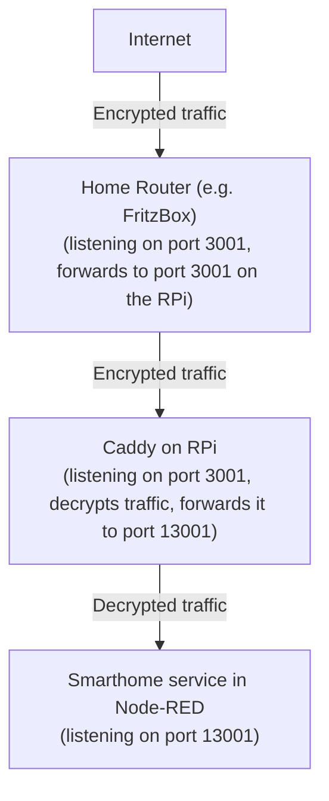

# Caddy as reverse proxy

This is an example of running the smarthome service behind Caddy (see [caddyserver.com](https://caddyserver.com/))
as a reverse proxy.

This way, SSL certificates from Let's Encrypt are automatically managed and renewed by Caddy. You don't need to install
other certificate management tools like Certbot. You also don't need to restart Node-RED on certificate renewals.

Ports 80 and 443 must be free. Services running on these ports must be moved to other ports. They can be proxied
via Caddy later.


## Guide

This guide assumes that your domain is example.com and you want to run the smarthome service on port 3001. Replace
domain and ports accordingly.

1. Uninstall certbot. Configure other applications currently listening on ports 80 and 443 to use different ports.
2. In Node-RED, open the Google Smarthome management node and set the port to 13001 to free up port 3001 for Caddy.
   Also enable the checkbox "Use external SSL offload". Then save and deploy.
3. If you had already set up node-red-contrib-google-smarthome, verify that the relocated smarthome service is still
   reachable by opening http://192.168.0.100:13001/check in your browser. Replace 192.168.0.100 with the IP address
   where Node-RED is running. You should see a success message.
4. On your home router, forward incoming ports 80, 443 and 3001 to the host where Caddy is running. DON'T forward port
   13001.
5. Install Caddy. On Ubuntu it's `apt-get install caddy`.
6. Edit Caddy's config file. On Ubuntu it is located in `/etc/caddy/Caddyfile`.
7. Remove all existing content and add the following lines:

   ```
   {
       # Email used by Let's Encrypt to contact you in case of problems. Replace with your email address.
       email info@example.com
   }
   
   # Replace example.com with your domain
   example.com {
       ## Uncomment this block if you want to make Node-RED externally accessible on your domain.
       ## To make Node-RED work with Caddy, open settings.js and comment out the sections "https" and "requireHttps".
       # route /* {
       #    reverse_proxy localhost:1880
       # }
      
       ## Remember to protect Node-RED! Set up authentication in settings.js or uncomment this block to use basicauth.
       ## You can encrypt passwords by running `caddy hash-password`.
       # basicauth * {
       #    myusername JDJhJDEwJEh6YW5CNU5zM28zbnF1OHVEWjNySHVGTFRHVVpSY2RyNDJZdUR4TnIvbzhTTWFzZTdmV2Zp
       # }

   }
   
   # Proxy from external port 3001 to the smarthome service on port 13001
   # Replace example.com with your domain.
   https://example.com:3001 {
       reverse_proxy localhost:13001
   }
   ```

8. Restart Caddy. On Ubuntu it's `systemctl restart caddy`.
9. Wait a minute. Certificate creation may take a while.
10. Go to https://example.com:3001/check in your browser. You should see a success message.
11. If you have any problems, check Caddy's log output. On Ubuntu it's `systemctl status -ln100 caddy`.
12. Done!


For a better understanding, the traffic flow in this setup is as follows:


