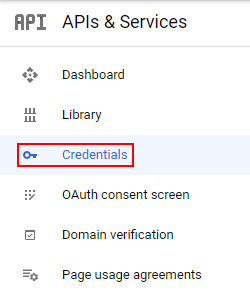
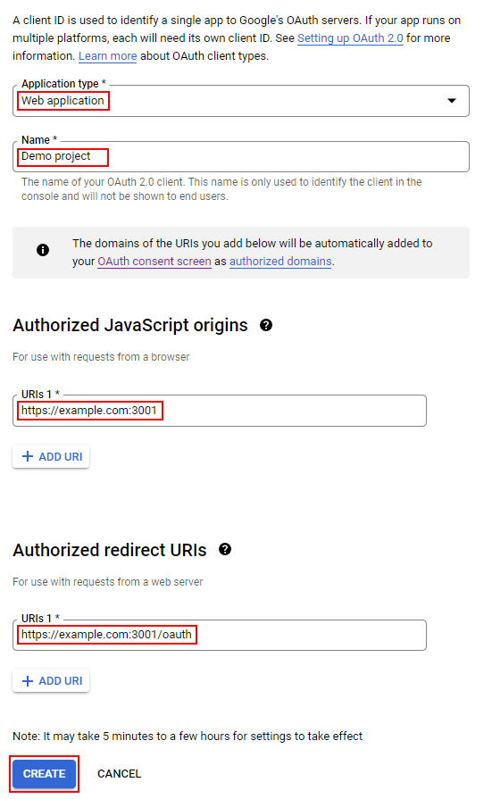
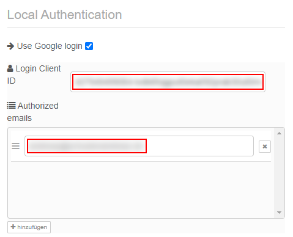
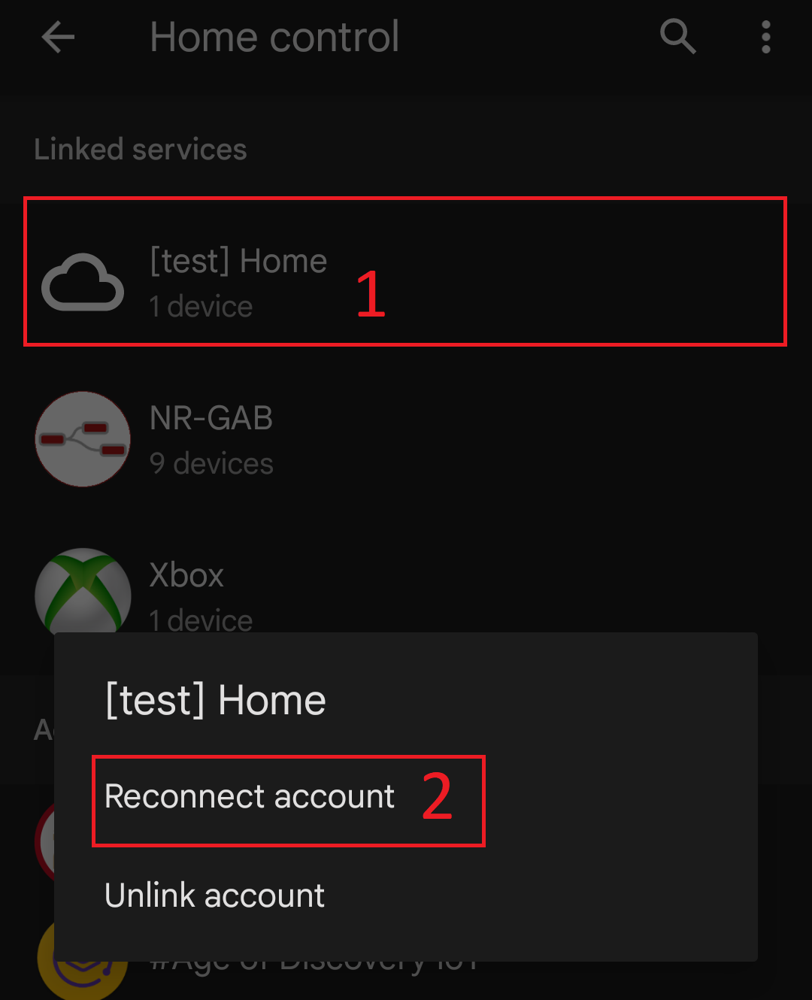
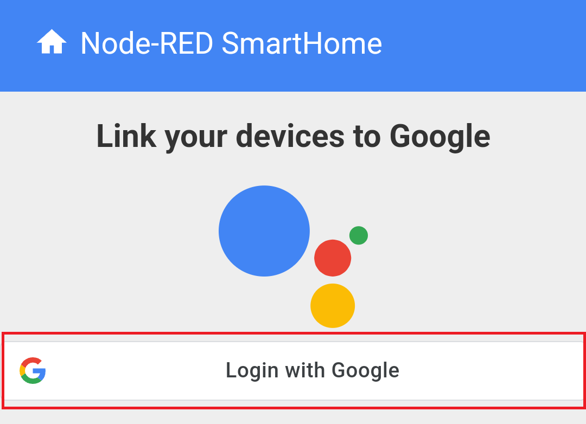

# Integrating Google Sign-In

If you followed the setup instructions, your project was created using username/password based authentication. You can
switch to authentication using Google Sign-In if you want. This makes relinking your project in the app a little easier
as you don't have to enter your username and password again. For regular users it is not necessary though.

1.  Navigate to the [GCP oAuth consent screen configuration](https://console.cloud.google.com/apis/credentials/consent).

2.  Check that your project is selected in the header bar.\
    <kbd></kbd>

3.  If you haven't already configured the OAuth consent screen, you will be asked for the user type. Select "External"
    and click "Create".\
    <kbd></kbd>

4.  If you've already configured your consent screen earlier, there's a link "Edit App" next to the title which
    will reopen the configuration form.\
    <kbd></kbd>

5.  Enter a name for your project, select your email address from the list and at the bottom of the form enter your
    email again as developer contact. Add your domain "example.com" (without protocol and port) as an authorized domain.
    Then click "Save and continue".\
    <kbd></kbd>

6.  In the next two steps, "Scopes" and "Optional info", leave all fields blank and click "Save and continue".

7.  In the last step you'll see a summary of your settings. Check that it looks like the screenshot. In particular,
    check that your domain is added as an authorized domain.\
    <kbd></kbd>

8.  Select "Credentials" from the left sidebar.\
    <kbd></kbd>

9.  Click "Create credentials" and select "OAuth client ID".
    <kbd></kbd>

10. Select "Web application" as the application type. Enter a name for your project. As "Authorized JavaScript Origin"
    enter the URL of your service without a path (https://example.com:3001). As "Authorized redirect URI" add the URL of
    your service with the path "/oauth" (https://example.com:3001/oauth). Then click "Create".\
    <kbd></kbd>

11. Copy the client ID. You will need it later.\
    <kbd></kbd>

12. If you return to this step later and need the client ID again, you can copy it from the table "OAuth 2.0 Client
    IDs". Make sure you copy from the correct row.\
    <kbd></kbd>

13. Open the configuration of the Google management node in Node-RED. Check "Use Google login" and enter the client ID
    you copied earlier. Add your email address (the one your Google account is registered with) as authorized email.
    Save and deploy your flows.\
    <kbd></kbd>

14. Re-link your account as described in the section [Setup Account Linking](setup_instructions.md#setup_account_linking).
    When you see the list of all services, click on your service and select "Reconnect account". On the next screen,
    select "Login with Google".\
    <kbd></kbd>\
    <kbd></kbd>
