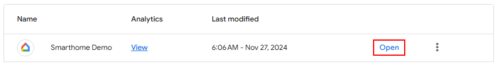
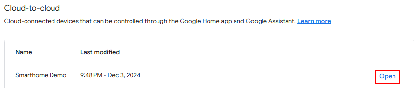
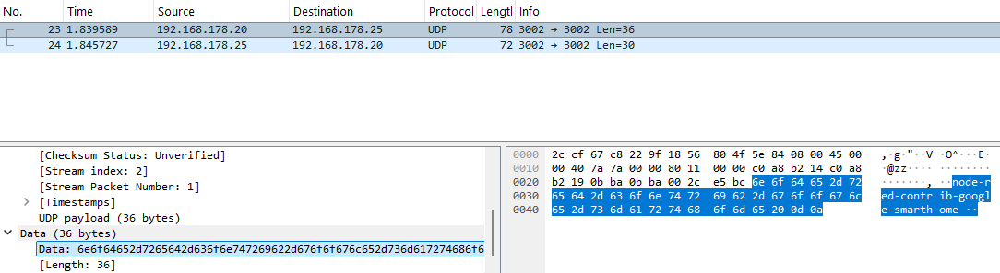
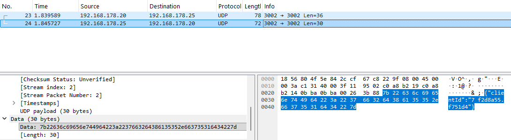

# Local fulfillment

Local fulfillment establishes direct communication between your smart speaker and Node-RED. This reduces latency
and makes your devices respond faster. However, it is not required. If local fulfillment is not set up or is not
available, Google will use the "normal" mode.


## How it works

When local discovery is set up, your smart speaker will regularly send discovery packets through your local network,
using mDNS or UDP. Our Node-RED module will listen to these packets and answer with its connection information (mainly
IP address and port). The smart speaker will then establish a direct HTTP connection to the Node-RED module over your
local network. Future commands will be sent from the smart speaker directly to Node-RED using this connection, without
going through the cloud.


## Prerequisites

- Your Smart Home service needs to be set up and working.
- All devices (Node-RED host and smart speaker) must be on the same local network/subnet, as the discovery packets are not routed between different networks.
- If you are using a firewall, configure it to allow UDP traffic on port 3002 or mDNS traffic (depending on if you choose UDP or mDNS) and TCP traffic on port 3002.


---

## Using local fulfillment with Docker containers

If you are running Node-RED inside a Docker container, you must use UDP, as mDNS will not work with containers.

In your container configuration, you must list the discovery port with UDP and the HTTP port with TCP. For example, if
you want to use port 3002 as both your discovery and HTTP port, the port configuration in your `docker-compose.yaml`
would have to look like this:

```yaml
ports:
    - "3002:3002/udp" # Discovery port for local execution, uses UDP
    - "3002:3002/tcp" # HTTP port for local execution, uses TCP
    # ... list other ports for Node-RED and the smarthome service
```

## Enable Local Fulfillment

This guide assumes that port 3002 is used for both the HTTP port and the UDP discovery port. You can change the port
numbers. Just make sure they still match.


1. Open the configuration of your management node in Node-RED.


2. Scroll down to the section `Local Fulfillment`. Fill in as follows:
    * Scan Type: Select either mDNS or UDP scanning. Which one works better depends on your network configuration. You
      may need to try both.
    * Discovery port: Node-RED will listen on this UDP port for discovery messages from your smart speaker. Set to
      port 3002. Don't create an external port forwarding for this port on your home router. Not available for mDNS.
    * HTTP port: Node-RED will listen on this HTTP port for control messages from your smart speaker. Set to port 3002.
      Don't create an external port forwarding for this port on your home router.
    * Discovery and HTTP ports can be the same.


3. Save and deploy.


4. Go to the [Google Home Developer Console](https://console.home.google.com/projects) and open your project.\
   <kbd></kbd>


5. Open your cloud-to-cloud integration.\
   <kbd></kbd>


6. Scroll down to the section "Cloud fulfillment URL" and enable "Local fulfillment".\
   <kbd></kbd>


7. Leave the "Testing URLs" empty.


8. Upload [this JavaScript file](https://raw.githubusercontent.com/mikejac/node-red-contrib-google-smarthome/master/local-execution/app.js)
   to both fields.\
   <kbd></kbd>


9. Tick the `Support local queries` checkbox.\
   <kbd></kbd>


10. Click the button `+ Add scan configuration` if you don't have a scan configuration yet.


11. Select mDNS or UDP depending on what you selected in the configuration of your management node.


12. For mDNS, fill in the fields as follows.<br>
    mDNS service name: Set to `_nodered-google._tcp.local`
    <br><br>
    For UDP, fill in the fields as follows,<br>
    * Discovery address: Set to `255.255.255.255`.
    * Listening port: Set to port 3002. Must be identical to the "Discovery Port" as set in the configuration of your management node. This is the port the smart speaker will listen on for responses to the discovery packets.
    * Broadcast port: Set to port 3002. Must be identical to the "Listen port". This is the port to which the smart speaker will send discovery packets.
    * Discovery packet: Set to `6e6f64652d7265642d636f6e747269622d676f6f676c652d736d617274686f6d65`.

13. `Save` your changes.


14. Restart Node-RED. When Node-RED has restarted, power-cycle your smart speaker.


15. Now control your device. If local fulfillment is working, you will see a ring icon instead of the usual filled
    circle.\
    <kbd></kbd>


Local fulfillment can be tricky to set up. If you encounter problems, see the
[troubleshooting section](#troubleshooting-local-fulfillment) below.


---
## Updating app.js

After updating node-red-contrib-google-smarthome, you may need to update the app.js script running on your smart
speaker. You'll get a warning on Node-RED's debug panel if this is needed.

1. Go to the [Google Home Developer Console](https://console.home.google.com/projects) and open your project.\
   <kbd></kbd>


2. Open your cloud-to-cloud integration.\
   <kbd></kbd>


3. Scroll down to the section "Cloud fulfillment URL".


4. Delete both app.js files.\
   <kbd></kbd>


5. Upload [this JavaScript file](https://raw.githubusercontent.com/mikejac/node-red-contrib-google-smarthome/master/local-execution/app.js)
   to both fields.\
   <kbd></kbd>


6. `Save` your changes.


7. Restart your smart speaker.


---
## Troubleshooting Local fulfillment

- You can test if local fulfillment works by saying "Hey Google, force local". Then try to control your devices. All
  actions will now be executed locally or will fail if local fulfillment is not available. Revert to normal mode by
  saying "Force default" or "Force cloud". This will work on non-English devices too. You may need several tries with
  different pronunciations though.
- Neither UDP nor mDNS are routed between subnets. If your smart speaker is on another subnet than your Node-RED host,
  you cannot use local fulfillment.
- Follow the sections below to verify the HTTP port and the UDP/mDNS traffic.
- After changing the settings on the Google Developer Console, you may need to restart your smart speaker.
- Open [chrome://inspect](chrome://inspect) in Chrome on your computer (not available on phone). Let it run for a while
  until your smart speaker is discovered. Click the `inspect` link. You'll see the console output of your smart speaker.
  The first two lines should read "Ready, App version: x.y" and "node-red-contrib-google-smarthome app.js ready!". If
  the local fulfillment connection was successfully established, you should see lines starting with "IDENTIFY" and
  "REACHABLE_DEVICES" as well as lots of other lines. Yellow warning lines are okay, but you should not see red error
  lines.
- The first lines in the chrome://inspect console will show the version number of the app.js script. Compare the
  version number to the one on the third line of the official
  [app.js script](https://raw.githubusercontent.com/mikejac/node-red-contrib-google-smarthome/master/local-execution/app.js).
  If they are different, update the app.js script as explained
  in the [setup instructions](setup_instructions.md#enable-local-fulfillment-optional). After updating app.js, you
  might have to restart your smart speaker.
- Sometimes it takes several hours for the local fulfillment connection to be established.
- If you experimented with local fulfillment and used "force local", remember to say "Hey Google, force default" to
  re-enable the automatic fallback to cloud fulfillment.
- If Node-RED is running in Docker, make sure you have selected UDP discovery and forwarded the HTTP and discovery
ports (port 3002 in TCP and UDP) into the container.


# Verify network connectivity

This won't guarantee that local fulfillment will work. But it can give you hints if the required ports are accessible.

## Verifying the HTTP port (used for both UDP and mDNS)

1. Take your phone or any other host in your network.
2. Open http://192.168.178.25:3002/check in the browser (with the IP of Node-RED and the port you chose as "HTTP Port"
   for local fulfillment).
3. You should see the message "SUCCESS".


## Verifying UDP discovery

**Verifying that the smart speaker is sending UDP discovery packets:**

1. Install an app like [UDP Monitor](https://play.google.com/store/apps/details?id=com.sandersoft.udpmonitor) on
       your phone.
2. Connect your phone to the same network as your smart speaker and Node-RED.
3. Start the UDP Monitor app.
4. Set "Local PORT" to 3002 (the port you set as UDP port on the Google Console).
5. Tap "Start receiving".
6. You should regularly see messages with the content "node-red-contrib-google-smarthome" coming from your smart speaker.

**Verifying that Node-RED is receiving UDP discovery packets:**

This can be tricky. Basically, you send a UDP packet to Node-RED and wait for Node-RED to respond. Unfortunately, some
versions of nc, ncat or socat won't display UDP answers, even if Node-RED does answer. To be sure, you can use Wireshark
as explained below.

1. Depending on your operating system:
   - If you use Linux, run: \
     `echo "node-red-contrib-google-smarthome" | nc -u -w1 192.168.178.25 3002` \
     If `nc` is not installed on your system, you can usually run the same command with `ncat` instead.
   - If you use Windows, install socat from the Cygwin package, then run: \
     `echo node-red-contrib-google-smarthome | c:\cygwin64\bin\socat.exe -t 10 - udp:192.168.178.25:3002,sp=3002`
2. You should see a response like `{"clientId":"df2d8b59.a731e4"}`
3. If you don't see a response, it might be because Node-RED did not answer. Or as said above, it might be because
   nc, ncat or socat did not display the response. To be sure, you can verify the traffic using Wireshark.
   Start Wireshark, let it capture your traffic (the shark fin icon in the toolbar) and filter to `udp.port == 3002`.
   Then, run the above commands again.\
   You should see the package you just sent, containing the string "node-red-contrib-google-smarthome":
   <kbd></kbd>
   You should also see the response coming from Node-RED, containing the JSON string:
   <kbd></kbd>


## Verify mDNS discovery

1. Install [Service Browser](https://play.google.com/store/apps/details?id=com.druk.servicebrowser) or a similar mDNS discovery tool on your phone.
2. It must find a service named "_nodered-google._tcp.".
3. Tap on it, then tap again on "nodered" to see the details. Check if the IP address and port are correct.
4. If Service Browser lists the "nodered" service with an additional domain, check the configuration files /etc/hostname
   and /etc/hosts. Both files must contain the hostname without a domain.
