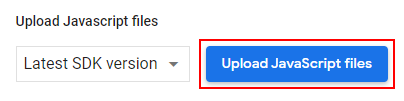
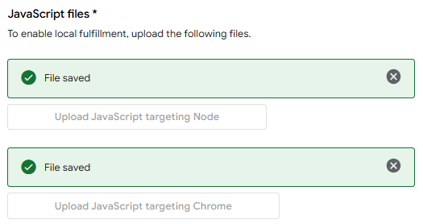
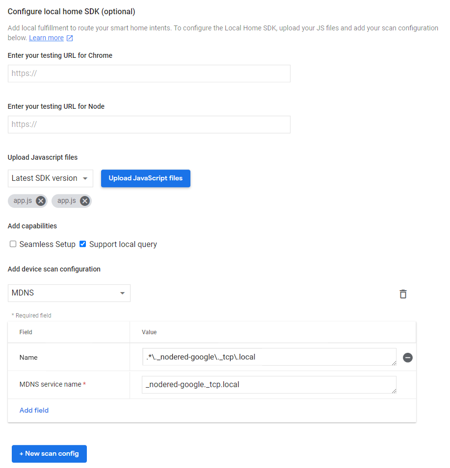
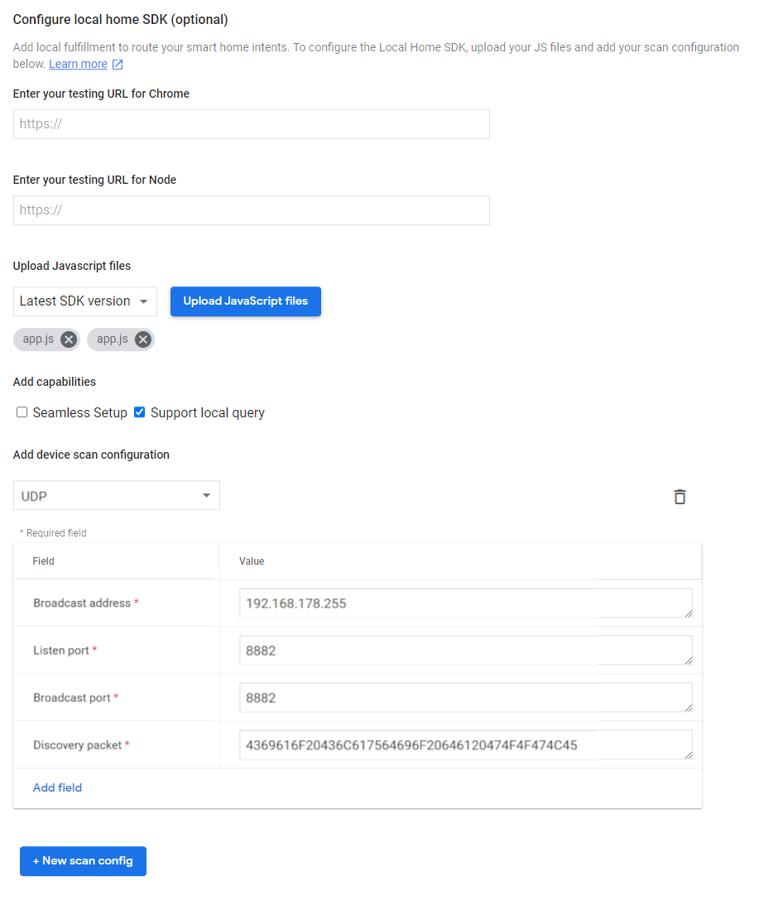
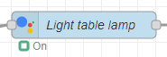
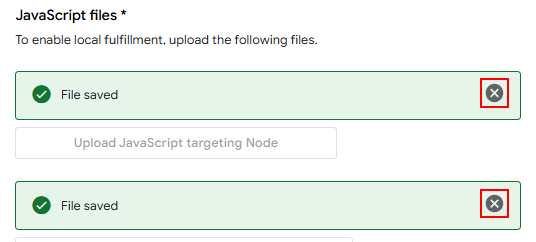

# Local fulfillment

Local fulfillment establishes direct communication between your smart speaker and Node-RED. This reduces latency
and makes your devices respond faster. However, it is not required. If local fulfillment is not set up or is not
available, Google will use the "normal" mode.

This tutorial assumes that your service is already set up and working.

---

## Enable Local Fulfillment

1. Open the configuration of your management node in Node-RED.

2. Scroll down to the section `Local Fulfillment`. Fill in as follows:
    * Scan Type: Select either mDNS or UDP scanning. Which one works better depends on your network configuration. You
      may need to try both.
    * Discovery port: Node-RED will listen on this port for discovery messages from your smart speaker. Enter any port
      that you want. Don't create an external port forwarding for this port on your home router.
    * HTTP port: Node-RED will listen on this port for control messages from your smart speaker. Enter any port you
      want. Don't create an external port forwarding for this port on your home router.

    Remember the discovery port. You will need to enter it in the Actions on Google Console later.

3. Save and deploy.

4. Open the [Actions on Google Console](https://console.actions.google.com/) and select your project.\
   <kbd></kbd>

5. Click `Develop` at the top of the page, then click `Actions` located in the hamburger menu at the top left.\
   <kbd></kbd>

6. Click the button `Upload JavaScript files`.\
   <kbd></kbd>

7. Upload [this JavaScript file](https://raw.githubusercontent.com/mikejac/node-red-contrib-google-smarthome/master/local-execution/app.js)
   for both Node and Chrome.\
   <kbd></kbd>

8. Tick the `Support local query` checkbox.\
   <kbd></kbd>

9. Click the button `+ New scan config` if you don't have a scan configuration yet.

10. Select mDNS or UDP depending on what you selected in the configuration of your management node.

11. For mDNS, fill in the fields as follows. 
    mDNS service name: Set to `_nodered-google._tcp.local`.
      
    For UDP, fill in the fields as follows, 
    Broadcast address: The IP range of your local network, e.g. `192.168.178.255`.
    Discovery packet: Set to `6e6f64652d7265642d636f6e747269622d676f6f676c652d736d617274686f6d65`.
    Listen port: Set the same port you set as "Discovery Port" in the configuration of your management node.
    Broadcast port: Set the same port you set as "Discovery Port" in the configuration of your management node.

13. The complete form for the mDNS scan type should look like this.\
    <kbd></kbd>

    The complete form for the UDP scan type should look like this.\
    <kbd></kbd>

14. `Save` your changes.

15. Restart your smart speaker and Node-RED.

16. Now control your device. If local fulfillment is working, you will see a ring icon instead of the usual filled
    circle.\
    <kbd></kbd>
    

Local fulfillment can be tricky to set up. If you have problems, look at the troubleshooting section in the readme.

---
## Updating app.js

After updating node-red-contrib-google-smarthome, you may need to update the app.js script running on your smart
speaker. You'll get a warning on Node-RED's debug panel if this is needed.

1. Open the [Actions on Google Console](https://console.actions.google.com/) and select your project.\
   <kbd></kbd>

2. Click `Develop` on the top of the page, then click `Actions` located in the hamburger menu on the top left.\
   <kbd></kbd>

3. Delete both app.js files.\
   <kbd></kbd>

4. Click the button `Upload JavaScript files`.\
   <kbd></kbd>

5. Upload [this JavaScript file](https://raw.githubusercontent.com/mikejac/node-red-contrib-google-smarthome/master/local-execution/app.js)
   for both Node and Chrome.\
   <kbd></kbd>

6. `Save` your changes.

7. Restart your smart speaker.

---
## Troubleshooting Local fulfillment

- You can test if local fulfillment works by saying "Hey Google, force local". Then try to control your devices. All
  actions will now be executed locally or will fail if local fulfillment is not available. Revert to normal mode by
  saying "Force default" or "Force cloud". This will work on non-english devices too. You may need several tries with
  different pronounciations though.
- Set a port for local fulfillment in the management node's config.
- Send an HTTP POST request to `http://192.168.178.25:13002/smarthome` (with the IP address of your host and the
  port you chose). E.g. run `curl -X POST http://192.168.178.25:13002/smarthome`. It should answer with
  `{"error":"missing inputs"}`. This error message is okay, all other messages indicate connection problems with the
  local fulfillment service.
- If you selected mDNS, install [Service Browser](https://play.google.com/store/apps/details?id=com.druk.servicebrowser) or a similar mDNS
  discovery tool on your phone. It must find a service named "_nodered-google._tcp.". Tap on it, then tap again on
  "nodered" to see the details. Check if the IP address and port are correct.
- If Service Browser lists the "nodered" service with an additional domain, check the configuration files /etc/hostname
  and /etc/hosts. Both files must contain the hostname without a domain.
- Open [chrome://inspect](chrome://inspect) in Chrome on your computer (not available on phone). Let it run for a while
  until your smart speaker is discovered. Click the `inspect` link. You'll see the console output of your smart speaker.
  The first two lines should read "Ready, App version: x.y" and "node-red-contrib-google-smarthome app.js ready!". If
  the local fulfillment connection was successfully established, you should see lines starting with "IDENTIFY" and
  "REACHABLE_DEVICES" as well as lots of other lines. Yellow warning lines are okay, but you should not see red error
  lines.
- The first lines in  the chrome://inspect console will show the version number of the app.js script. Compare the
  version number to the one on the third line of the official
  [app.js script](https://raw.githubusercontent.com/mikejac/node-red-contrib-google-smarthome/master/local-execution/app.js).
  If they are different, update the app.js script as explained
  in the [setup instructions](docs/setup_instructions.md#enable-local-fulfillment-optional). After updating app.js, you
  might have to restart your smart speaker.
- Sometimes it takes several hours for the local fulfillment connection to be established.
- If you experimented with local fulfillment and used "force local", remember to say "Hey Google, force default" to
  re-enable the automatic fallback to cloud fulfillment.
