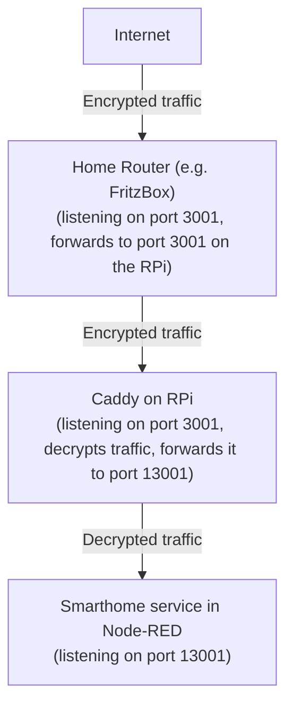

# Using a reverse proxy

You can use a reverse proxy in front of your smarthome service. This way, SSL certificates from Let's Encrypt are
automatically managed and renewed by the proxy, without installing and configuring other certificate management tools
like Certbot.

Ports 80 and 443 must be free. Services running on these ports must be moved to other ports. They can be proxied
via Caddy later.


## Caddy as reverse proxy

This is an example of using Caddy (see [caddyserver.com](https://caddyserver.com/)) as a reverse proxy.

This guide assumes that your domain is example.com and you want to run the smarthome service on port 3001. Replace
domain and ports accordingly.

1. Uninstall certbot. Configure other applications currently listening on ports 80 and 443 to use different ports.
2. In Node-RED, open the Google Smarthome management node and set the port to 13001 to free up port 3001 for Caddy.
   Also enable the checkbox "Use external SSL offload". Then save and deploy.
3. If you had already set up node-red-contrib-google-smarthome, verify that the relocated smarthome service is still
   reachable by opening http://192.168.0.100:13001/check in your browser. Replace 192.168.0.100 with the IP address
   where Node-RED is running. You should see a success message.
4. On your home router, forward incoming ports 80, 443 and 3001 to the host where Caddy is running. DON'T forward port
   13001.
5. Install Caddy. On Ubuntu it's `apt-get install caddy`.
6. Edit Caddy's config file. On Ubuntu it is located in `/etc/caddy/Caddyfile`.
7. Remove all existing content and add the following lines:

   ```
   {
       # Email used by Let's Encrypt to contact you in case of problems. Replace with your email address.
       email info@example.com
   }
   
   # Proxy from external port 3001 to the smarthome service on port 13001
   # Replace example.com with your domain.
   https://example.com:3001 {
       reverse_proxy localhost:13001
   }
   ```

8. Restart Caddy. On Ubuntu it's `systemctl restart caddy`.
9. Wait a minute. Certificate creation may take a while.
10. Go to https://example.com:3001/check in your browser. You should see a success message. There should not be any
    certificate warnings from your browser.
11. If you have any problems, check Caddy's log output. On Ubuntu it's `systemctl status -ln100 caddy`.
12. Done!

13. You can also use Caddy to make your Node-RED admin interface externally avaiable. **This is optionsl!**. Add this at
    the end of your config, then restart Caddy:

    ```
    # Replace example.com with your domain
    example.com { 
        # To make Node-RED work with Caddy, open settings.js and comment out the sections "https" and "requireHttps".
        route /* {
            reverse_proxy localhost:1880
        }

        # ?rotect Node-RED!!! Set up authentication in settings.js or uncomment this block to use HTTP auth.
        # You can encrypt passwords by running `caddy hash-password`.
        basicauth * {
            myusername JDJhJDEwJEh6YW5CNU5zM28zbnF1OHVEWjNySHVGTFRHVVpSY2RyNDJZdUR4TnIvbzhTTWFzZTdmV2Zp
        }
    }
    ```

For a better understanding, the traffic flow in this setup is as follows:



# Nginx proxy Manager as reverse proxy

Another option is [Nginx Proxy Manager](https://nginxproxymanager.com/). This guide was written by @RichardUUU on how to
use Nginx Proxy Manager when running Node-RED as a Home Assitant add-on:

Go into your domain DNS and create a subdomain: e.g. nr.example.com. Point that to your home IP.

In NGINX Reverse Proxy, create a new Proxy Host that sends nr.example.com to your HASSIO machine IP with a port of your choosing e.g. 192.168.1.101:1234 This should not expose your whole NodeRed, just the SmartHome server.

NGINX can request a new SSL certificate for you, or use a wildcard if you have one.

When installing google actions, account linking, service account, credentials etc. there is no need to list any ports. Just use nr.example.com

In Node Red, set the Google SmartHome configuration node to your chosen port: e.g. 1234

Now test: https://nr.example.com/check
